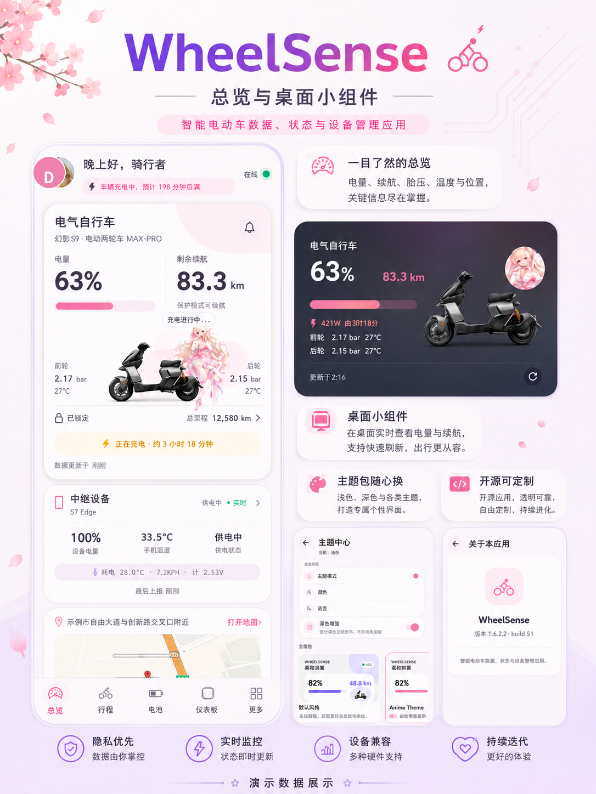
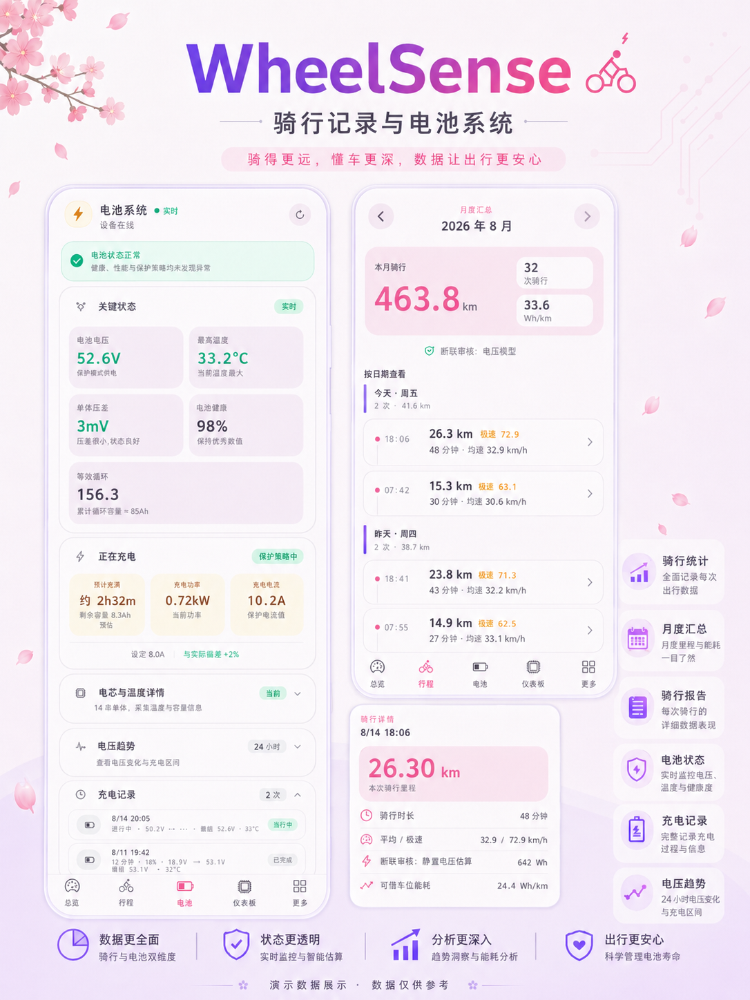
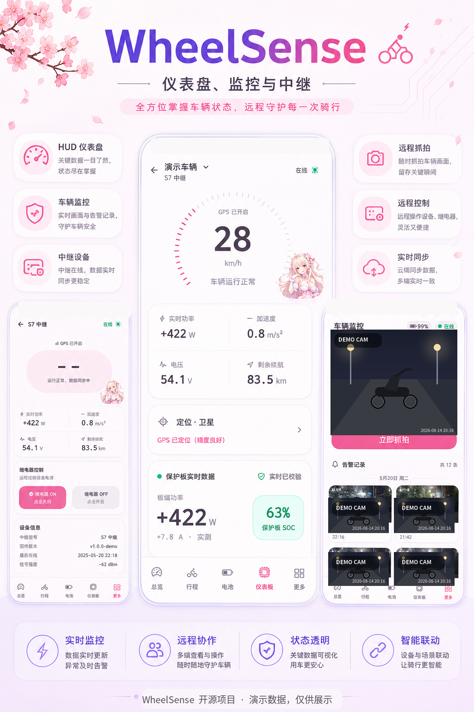
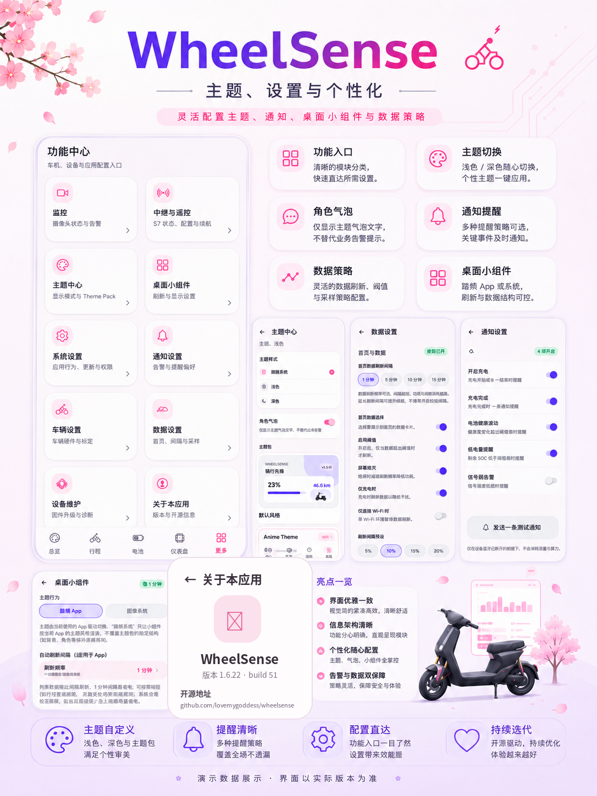
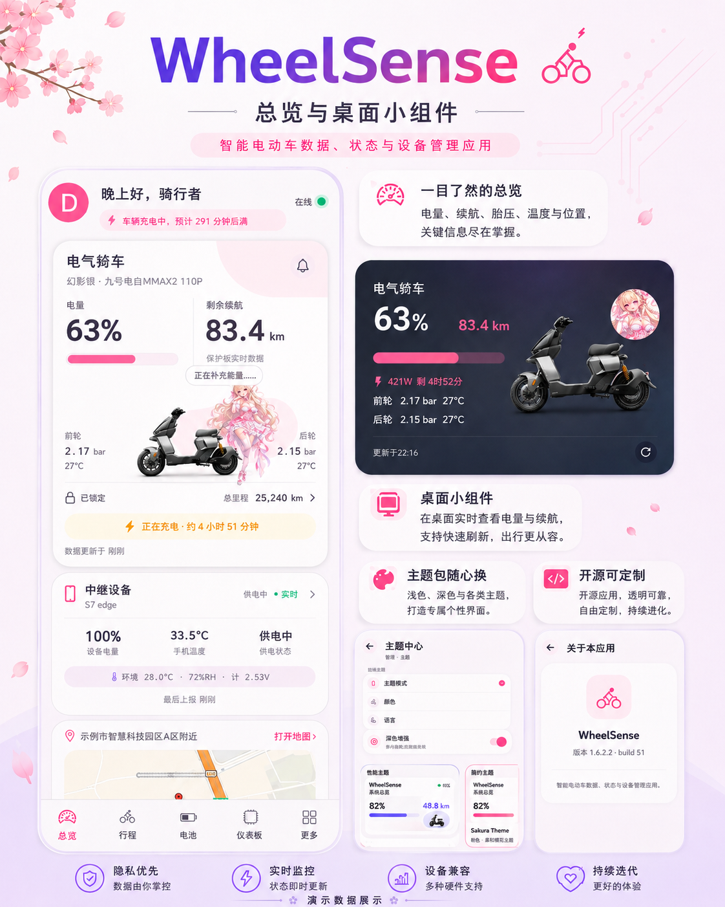
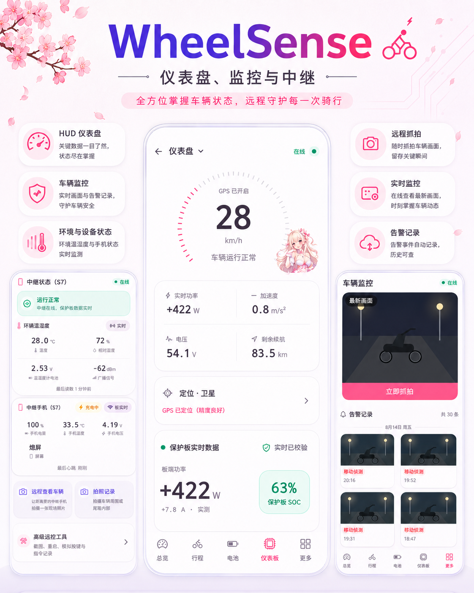
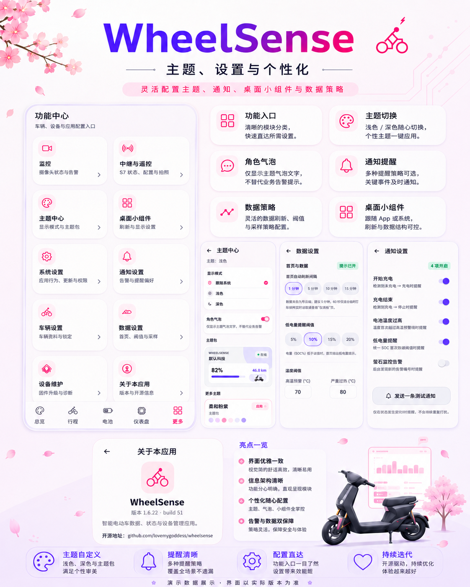

# WheelSense

  <b>面向电动两轮车的开源、自托管车辆遥测仪表盘</b> 
  把车辆、BMS、中继设备与行程数据，整理成一套真正属于车主自己的车辆数字仪表。

  <a href="README.md">简体中文</a> · <a href="README_EN.md">English</a>

  <b>Your ride. Your data. Your dashboard.</b>

WheelSense 是面向电动自行车和其他电动两轮车的开源、自托管车辆遥测系统。它把底层 BMS、胎压与环境传感器、中继手机、服务端和日常 App 放在同一条可解释的数据链路中，让车主自己保存和管理车辆数据。

## WheelSense 是什么

项目由四个主要部分组成：

| 组件 | 作用 |
| --- | --- |
| **WheelSense Dashboard** | React Native / Expo Android App，用于查看车辆总览、实时仪表、电池、行程、监控和设置。 |
| **WheelSense Relay** | Kotlin Android BLE 中继，采集 BMS、TPMS 和环境传感器数据，在本地缓存后同步到自托管服务端。 |
| **WheelSense Server** | Laravel 后端，负责遥测快照、历史记录、数据源选择、告警和配置。 |
| **Android Widget** | 原生桌面小组件，无需打开 App 即可查看 SOC、续航、胎压和更新时间。 |

WheelSense 不运营集中式车辆遥测云。部署者运行自己的 Server，数据边界由使用者自己决定。

## ✨ 项目预览

<table>
  <tr>
    <td align="center" valign="top"> Overview &amp; Widget</td>
    <td align="center" valign="top"> Rides &amp; Battery</td>
  </tr>
  <tr>
    <td align="center" valign="top"> Dashboard / Monitor / Relay</td>
    <td align="center" valign="top"> Theme &amp; Settings</td>
  </tr>
  <tr>
    <td align="center" valign="top"> Overview &amp; Widget · extended showcase</td>
    <td align="center" valign="top"> Dashboard / Monitor / Relay · extended showcase</td>
  </tr>
  <tr>
    <td colspan="2" align="center"> Theme &amp; Settings · extended showcase</td>
  </tr>
</table>

> 展示图使用 Demo / synthetic data，并对公开展示所需的身份、位置与监控画面进行了匿名化或演示化处理，不代表真实车辆或真实使用环境。
>
> 实际功能与界面请以当前版本和仓库源码为准。

## ✨ 主要功能

### 车辆总览

- SOC、剩余续航、总里程和更新时间；
- 前后轮 TPMS 胎压 / 胎温；
- 锁车状态、车辆在线状态和中继连接状态；
- 中继手机电量、手机温度、供电状态和环境温湿度；
- 地图位置与数据新鲜度提示。

### 实时 Dashboard

- GPS 实时速度、实时功率、加速度和电压；
- 剩余续航、卫星 / 定位状态和 BMS 状态；
- 面向骑行读取优先的 HUD 布局，速度读数保持第一视觉层级。

### Battery / BMS

- SOC、电压、电流、功率和电池健康度；
- 循环次数、单体最高 / 最低电压与单体压差；
- 单体电压、温度、充电记录和电压历史趋势；
- 电压趋势支持点选、拖动、crosshair 和 Tooltip。

### Trips

- 今日骑行、历史行程和日期时间线；
- 里程、时长、平均速度、能耗和行程地图；
- 月度摘要与行程详情。

### Relay

- BLE BMS 采集与协议解析；
- TPMS、环境传感器和中继设备状态；
- 本地缓存、批量上传、失败重试和弱网 / 离线补传。

### Monitor

- 查看告警截图与告警记录；
- 立即抓拍并打开摄像头 App；
- 摄像头内容是可选集成，不等同于完整实时录像、PTZ 或云录像回放。

### Android Widget

- SOC、剩余续航、前后胎压 / 胎温和更新时间；
- 跟随 App 的 Theme Pack；
- Demo Mode 下显示合成数据并带有克制的 DEMO 标识。

## 🧪 Demo Mode

没有真实车辆或服务端时，也可以用 Demo Mode 体验主要界面。开启后，Overview、Dashboard、Battery、Trip、Relay、Monitor 和 Widget 使用集中维护的 synthetic / deterministic 数据；它们与真实数据隔离，不会请求或写入真实车辆历史。

Demo Mode 适合：

- 截图和录屏；
- UI 调试；
- Theme Pack 开发与展示；
- 在没有硬件的情况下演示数据流和交互。

真实设备操作在演示模式下会被拦截或模拟，不会向真实设备发送命令。关闭 Demo Mode 后恢复自托管数据源。

## 🎨 Theme Pack

Theme Pack 与数据逻辑独立，负责颜色、Light / Dark 层级、页面装饰、Dashboard / Widget 视觉和可选 dialogue / artwork 资源。

当前包含：

- **Default-Tech**：冷紫科技风；
- **Anime Theme 01**：奶白、樱粉和柔紫方向的主题包。

Anime Theme 01 的 Chii artwork 是单独标注的第三方 fan artwork，不属于 WheelSense MIT License 的授权范围。使用前请阅读 [THIRD_PARTY_NOTICES.md](THIRD_PARTY_NOTICES.md) 和 [Anime Theme 01 NOTICE](apps/dashboard/assets/themes/anime-01/NOTICE.md)。

## 🏗️ 系统架构

~~~mermaid
flowchart LR
  BMS["BMS / BLE"] --> RELAY["WheelSense Relay"]
  SENSOR["TPMS / 环境传感器"] --> RELAY
  RELAY --> SERVER["WheelSense Server"]
  SERVER --> DASH["WheelSense Dashboard"]
  SERVER --> WIDGET["Android Widget"]
  BRIDGE["可选、独立、非官方 NineCLI compatibility bridge"] -.-> SERVER
~~~

NineCLI 只表示可选的第三方兼容桥接，不是 WheelSense 官方 API，也不是 Ninebot / Segway 官方服务。

## 📐 数据可信性设计

WheelSense 不把“存在一个数值”当作“这个数值仍然可信”。系统会同时关注：

- 数据来源、采集时间和新鲜度；
- 实时、陈旧、离线、降级和不可用状态；
- BMS 优先级与不同来源之间的一致数据契约；
- 基于实测 V × I × Δt 的能耗区间，而不是无条件相信厂商估算；
- 数据缺口、覆盖率和异常样本，避免污染长期学习结果；
- 首页、电池页、小组件和 API 使用同一份主遥测结果。

更详细的部署与配置说明见 [docs/configuration.md](docs/configuration.md)。

## 📁 项目结构

~~~text
apps/dashboard/   React Native / Expo Android Dashboard 与 Widget
apps/relay/       Kotlin Android BLE Relay
server/           Laravel API、数据模型与后台任务
docs/             部署和配置说明
tools/            Demo 截图渲染等维护工具
~~~

## 🚀 快速开始

### Dashboard

需要 Node.js 20+、JDK 17 和 Android SDK。开发启动：

~~~bash
cd apps/dashboard
npm ci --legacy-peer-deps
npx expo start
~~~

连接 Android 设备进行原生调试：

~~~bash
npx expo run:android
~~~

Android Server URL 可在 App 设置中填写；开发构建也支持 [apps/dashboard/.env.example](apps/dashboard/.env.example) 中的 EXPO_PUBLIC_SERVER_URL。公开源码不会内置作者的服务器地址、账号或设备标识。

### Relay

Relay 工程使用 Kotlin、JDK 17 和 Android SDK 35：

~~~bash
cd apps/relay
./gradlew assembleDebug --no-daemon
~~~

安装后，在 Relay 高级设置中填写自己服务端生成的地址、Token / HMAC 和已获授权的设备标识。不要把真实凭证提交到 Git。

### Server

最简单的部署路径是 Docker Compose：

~~~bash
cp server/.env.example server/.env
mkdir -p data/database data/storage
docker compose build
docker compose run --rm server php artisan key:generate --show
docker compose run --rm server php artisan evtelemetry:relay-credentials
docker compose up -d
docker compose exec server php artisan evtelemetry:set-dashboard-password
~~~

将生成的 APP_KEY、BMS_RELAY_TOKEN 和 BMS_RELAY_HMAC_SECRET 写入自己的 server/.env。服务默认监听 http://<host-ip>:8000；公网部署前应配置 HTTPS 反向代理，不要直接暴露 PHP 开发服务器。

手动 Laravel 开发环境可参考 server/composer.json 的 setup 脚本，并在部署前阅读 [docs/configuration.md](docs/configuration.md)。

## 🔐 数据与隐私

WheelSense 是 self-hosted 项目，维护者不运营集中式车辆数据平台。GPS、行程、BMS、摄像头、账号和传感器数据应保存在使用者自己的 Server。

公开仓库不会内置：

- password、Token、API Secret、HMAC Secret 或 signing key；
- 车辆 SN / VIN、真实 MAC、GPS 或私有服务器凭据；
- 摄像头验证码、数据库、照片、轨迹或真实设备缓存。

部署前请阅读 [SECURITY.md](SECURITY.md) 和 [PRIVACY.md](PRIVACY.md)。只连接、读取或控制自己拥有，或已经获得明确授权的车辆、账号、BMS、传感器和摄像头。

## 技术栈

| Component | Technology |
| --- | --- |
| Dashboard | React Native / Expo |
| Android Native | Kotlin |
| Widget | Android AppWidget / Canvas |
| Relay | Android / BLE |
| Server | Laravel |
| Demo | Synthetic deterministic fixtures |

## ⚠️ 第三方兼容性声明

WheelSense 是独立、非官方的第三方开源项目，与 Ninebot、Segway、九号及其关联公司不存在官方隶属、授权、合作、赞助或背书关系。相关名称和商标只用于说明 compatibility 或 data source，权利归各自原权利人。

NineCLI 如被使用，只是 optional、independent、unofficial compatibility bridge，不代表官方 Ninebot API。项目不包含该桥接服务。

## 📜 License

WheelSense 自有源码使用 [MIT License](LICENSE)。第三方依赖、商标、图片和 fan artwork 遵循各自的许可与权利边界；请同时阅读 [THIRD_PARTY_NOTICES.md](THIRD_PARTY_NOTICES.md)。仓库主体采用 MIT 不会把第三方角色或作品自动授权为 MIT。

---

  <b>WheelSense</b> 
  Your ride. Your data. Your dashboard.

