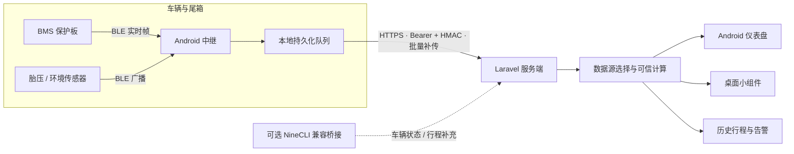

# WheelSense

[简体中文](README.md) | [English](README_EN.md)

This is an independent third-party open-source project. It is not affiliated with, endorsed by, sponsored by, or officially connected with Ninebot, Segway, 九号, or their affiliates. Product and trademark names are used only to identify compatibility or data sources. NineCLI is an optional independent compatibility bridge; it is not included here and this project does not represent an official Ninebot API. Use the software only with accounts, vehicles, sensors, and cameras you own or are explicitly authorized to access.

**本项目是独立开发的开源 EV 遥测工具，可与 Ninebot/九号设备的第三方兼容桥接服务配合使用。本项目与 Ninebot、Segway、九号及其关联公司不存在隶属、授权、赞助或官方合作关系；相关名称和商标仅用于客观描述兼容性，权利归各自权利人所有。**

WheelSense 是一套自托管的两轮车遥测系统，由 Laravel 服务端、React Native/Expo 仪表盘和 Android 尾箱中继组成。它可展示电量、电压、电流、单体压差、温度、行程、胎压和位置，并在中继离线时将数据持久化后补传。
[](https://github.com/lovemygoddess/wheelsense/actions/workflows/ci.yml)
[](LICENSE)
[](#编译-android-应用)
[](#快速部署服务端)

**把散落在车辆、BMS、尾箱手机和云端的数据，变成一套可信、连续、由车主自己掌控的车辆状态。**

WheelSense 是一套面向电动两轮车的开源自托管遥测系统。它由 Laravel 服务端、Android BLE 中继、React Native 仪表盘和原生桌面小组件组成，覆盖从传感器采集、离线缓存、可信计算到消费级展示的完整链路。

它不只是把接口字段画成图表。这个项目更关注车辆遥测中真正棘手的问题：

- **同一个数字到底信谁？** BMS、车辆云端和历史估算可能同时给出不同的电量、功耗和续航；系统需要明确数据来源、新鲜度和降级规则。
- **中继或网络断开后怎么办？** 尾箱手机可能休眠、断网、没电或重启；数据不能因此悄悄丢失，也不能把旧值伪装成实时值。
- **估算怎样尽量接近真实骑行？** 续航和充电时间优先使用保护板实测电流、剩余容量和能量区间，而不是无条件相信厂商估算值。
- **数据属于谁？** 轨迹、位置、车辆状态和照片具有高敏感性，因此服务端由使用者自行部署，项目维护者不运营集中数据平台。
- **怎样让失败是可见的？** 页面会区分实时、陈旧、离线和降级状态；“有数值”不等于“数据仍然可信”。


*Project overview image for a quick visual introduction. The project is independent and unofficial; product names shown in the image are used only to describe compatibility.*

> Self-hosted telemetry for electric two-wheelers, with an offline-first Android relay, explicit source freshness, measured-energy calculations, and privacy-preserving data ownership.

## 界面预览


<p align="center">
  
  
  
</p>
<p align="center">
  
  
  
</p>

### Android 桌面小组件


> 以上图片使用匿名合成的示例数据，用于展示当前应用的信息层级和视觉语言；不包含真实车辆、账号、服务器、轨迹或传感器标识。可复现的渲染脚本位于 [`tools/render_demo_screenshots.py`](tools/render_demo_screenshots.py)。

### 演示模式与主题包

- More 页面中的“演示模式”会把车辆、中继、电池、行程、监控和小组件切换到集中维护的稳定模拟数据，避免展示真实车辆信息；关闭后恢复自托管服务数据。
- Demo Mode 与视觉主题相互独立，可在 Default-Tech、Light/Dark 和 Anime Theme 01 之间切换。Dashboard 的动态指标使用可预测的轻量模拟器，适合截图、录屏和现场演示。
- Theme Pack 只负责颜色、布局和可选装饰资源。Anime Theme 01 使用 WheelSense 项目的原创角色图像；该图像不属于 MIT 代码许可范围，使用前请阅读 [`apps/dashboard/assets/themes/anime-01/NOTICE.md`](apps/dashboard/assets/themes/anime-01/NOTICE.md)。
- 移动端服务地址不会写死在公开源码中：可在 App 设置中填写，或在开发构建中使用 [`apps/dashboard/.env.example`](apps/dashboard/.env.example) 的 `EXPO_PUBLIC_SERVER_URL`。

## 为什么做这个项目

许多车辆应用只展示厂商云端已经计算好的结果，保护板工具则通常停留在蓝牙调试页面。两者之间缺少一套可以长期运行的完整系统：既能靠近车辆采集底层数据，又能把它整理成日常真正可读的状态；既能在中继在线时使用实时 BMS，又能在设备掉线时诚实降级；既能保留轨迹和历史，又不要求把私人数据交给新的云平台。

本项目把这条链路完整开源，希望提供的不只是一个特定车型的界面，也是一份可复用的工程参考：

- Android 后台 BLE 采集与无人值守运行；
- 弱网和离线场景下的本地队列、批量补传与去重；
- 多数据源的优先级、新鲜度和一致性契约；
- 基于实测 `V × I × Δt` 区间的能耗学习；
- SOC、续航、充电时间和连接状态在不同页面之间保持同一口径；
- 敏感遥测、远程控制和 APK 更新链路的安全边界。

## 可信计算：不是“有个数”，而是知道这个数从哪里来

本项目花费最多精力的部分不是界面，而是把互相冲突、更新频率不同的数据整理成一套可解释的结果。系统不会简单照搬车辆云端给出的电量、功耗或续航，也不会在实时数据已经失效后继续把旧值当成当前值。

### 实时充电功率

- 保护板在线时，以同一实时帧中的电压和充电电流计算 `P = V × I`，并保留充电/放电方向；不使用 NineCLI 功耗作为核心依据；
- 只有新鲜的保护板电流达到充电判定阈值时，才优先认定正在充电，避免仅凭陈旧状态或车辆事件误判；
- 当前帧不完整、时间过旧或电流方向不可信时，结果会降级或标为不可用，不用表面精确的小数掩盖数据缺失。

### 剩余充电时间

- 首选保护板的总容量、剩余容量和实时充电电流，计算尚需补入的 Ah，并根据当前 SOC 加入恒压末段降流修正；
- 保护板容量计数与端电压明显矛盾时，不会直接显示“已满”或“剩余 1 分钟”，而会改用可信度更低的电量/电压模型；
- 缺少实时容量时，可按已校准电池能量、统一 SOC 和实测充电功率估算；历史完整充电曲线只作为后备模型；
- 样本不足、模型退化或结果超出合理上限时，宁可显示“暂不可估算”，也不输出误导性的精确分钟数。NineCLI 充电事件仅在中继不可用时提供可选的历史上下文。

### 可信剩余续航

- SOC 优先采用保护板未取整的“剩余 Ah ÷ 总 Ah”，减少整数百分比临界点造成的上下跳动；保护板不可用时才降级到电压曲线，厂商 SOC 仅作参考；
- 骑行能量按保护板连续帧对 `V × I` 做时间积分。超过 180 秒的数据缺口不强行补算，整段行程覆盖率不足 85% 时不进入学习；
- 只学习物理范围合理的行程样本；样本充足后使用中位数绝对偏差过滤异常值，并让较新的真实骑行获得更高权重；
- 最终续航按“可信 SOC × 可用电池能量 ÷ 可信实测 Wh/km”统一计算，不回退到按原厂电池标定的厂商续航，避免改装或非原装电池出现明显虚高；
- 首页、小组件和 API 复用同一份主遥测结果，避免不同页面各算一套、同时出现多个剩余里程。

### 离线时诚实降级

中继在线且保护板帧新鲜时使用实时 BMS；保护板暂时不可用时，可按场景降级到静置电压、最近可信校准或可选车辆快照。每个结果同时携带来源、采集时间、新鲜度、可信等级和降级原因，因此“中继在线”“保护板已连接”和“这条数据仍可用于实时判断”不会再被混为同一个状态。

## 设计原则

| 原则 | 项目中的实现 |
| --- | --- |
| 实测优先 | 可用时以 BMS 电压、电流、剩余容量和单体数据为主，不使用 NineCLI 功耗作为核心能耗依据 |
| 新鲜度优先于“有值” | 每份快照携带采集时间；实时、陈旧、离线和不可用是不同状态 |
| 可解释降级 | 中继离线时保留可用的车辆快照或校准结果，并在界面明确标注来源与时效 |
| 离线优先 | 中继先落地采样与事件，再批量回传；短时断网不会直接形成历史空洞 |
| 单一口径 | 首页、电池页、小组件和 API 复用统一的 SOC、续航、充电与连接状态契约 |
| 最小权限 | 中继远控默认关闭，危险命令独立开关；凭证、位置和照片不进入仓库 |
| 自己掌控数据 | 服务端由使用者部署，维护者不接收车辆遥测、轨迹或账号信息 |

## 系统如何工作



### 数据源与降级关系

| 数据 | 首选来源 | 不可用时的行为 |
| --- | --- | --- |
| 电压、电流、SOC、温度、单体电压 | 中继上报的实时 BMS | 明确标为陈旧/离线，必要时使用车辆快照或校准估算 |
| 骑行能耗 | BMS 实测能量区间 `∫V·I·dt` | 样本覆盖不足时不学习，避免用残缺区间污染长期平均值 |
| 续航 | 统一 SOC/剩余能量与可信实测能耗 | 数据不足时降级显示，不在不同页面各算一套 |
| 充电剩余时间 | BMS 剩余容量、实时充电电流与末段降流模型 | 中继离线时才参考可选车辆事件，无法判断时不伪造精确分钟数 |
| 行程与最高速度 | 可选车辆兼容桥接 | 未配置时保留 BMS 电池能力，云端行程相关功能降级 |
| 胎压与胎温 | TPMS BLE 广播 | 超过新鲜度窗口后隐藏或标记不可用 |

## 主要能力

### 日常仪表盘

- 总览、电池、仪表、行程和设置页面采用统一的消费级视觉语言；
- 电量、可信续航、功率、温度、单体压差、胎压和位置分层展示；
- Android 桌面小组件显示车辆、电量、续航、充电状态、位置与新鲜胎压；
- 连接状态不是简单的在线/离线布尔值，而是区分中继、保护板和数据帧时效；
- 详细单体、电池诊断和开发信息默认折叠，日常界面不过载。

### 无人值守 Android 中继

- Android 8+ 前台服务持续连接 BMS 并扫描 BLE 传感器；
- 本地持久化队列、批量上传、失败重试和历史补传；
- 上报中继手机电量、充电和运行状态，便于发现尾箱设备异常；
- 支持开机恢复、远程配置与同签名 APK 更新；
- 拍照、截图、重启和系统命令属于可选运维能力，服务端默认拒绝。

### 服务端与数据计算

- Laravel API 与 SQLite 存储，可使用 Docker Compose 自托管；
- Relay Bearer Token 与请求体 HMAC 双重校验，支持成对凭证轮换；
- 统一快照契约，为 App、小组件和历史页面提供一致结果；
- 基于覆盖率约束的实测能耗学习，避免陈旧或残缺数据污染估算；
- 行程、月度摘要、充电会话、胎压、环境样本和告警历史；
- 可选高德地图、萤石云、通知 Webhook 与 NineCLI 兼容桥接。

## 仓库组成

| 路径 | 内容 |
| --- | --- |
| `server/` | Laravel API、SQLite 数据模型、可信计算、历史任务、告警与更新分发 |
| `apps/dashboard/` | React Native/Expo Android 仪表盘、原生模块与桌面小组件 |
| `apps/relay/` | Kotlin Android BLE 中继、协议解析、离线队列与无人值守服务 |
| `docs/` | 部署与配置说明 |
| `.github/workflows/` | 服务端、仪表盘和中继的持续集成检查 |

## 适用场景与项目边界

WheelSense 不是面向所有车型的通用车辆 App。它主要服务于以下用户：

- 使用第三方、替换或改装电池包，导致厂商 SOC、功耗或续航估算失真的车主；
- 愿意使用 Docker，在 Linux 主机、NAS 或树莓派上自行部署服务的技术型用户；
- 关注 BMS、BLE、TPMS、多数据源融合与车辆数据可信度的开发者和爱好者；
- 重视数据自主权，希望车辆轨迹、位置、账号和传感器数据留在自己服务器上的用户。

本项目需要部署者自行配置服务器、确认设备协议适配、管理凭据并完成必要的安全加固。如果你需要的是云端托管、低配置、开箱即用的通用车型 App，它可能并不适合你。

项目的目标不是覆盖尽可能多的车型和用户，而是解决一个更具体的问题：在多数据源相互冲突、中继或网络可能中断、车辆使用非原厂硬件的现实环境中，如何得到可信、连续、可解释且能够诚实降级的车辆状态。

它既是一套供真实车主长期运行的自托管系统，也是一份面向 BMS、BLE、车辆遥测与离线采集开发者的完整参考实现。它不是硬件安全控制器；不同 BMS 协议、车辆接口和 TPMS 编码仍需针对真实设备验证。

## 快速部署服务端

需要 Docker 和 Docker Compose。

```bash
cp server/.env.example server/.env
mkdir -p data/database data/storage
docker compose build
docker compose run --rm server php artisan key:generate --show
docker compose run --rm server php artisan evtelemetry:relay-credentials
```

将第一条命令输出的 `base64:...` 填入 `server/.env` 的 `APP_KEY`，再将最后一条命令输出的 `BMS_RELAY_TOKEN` 和 `BMS_RELAY_HMAC_SECRET` 填入同一文件，然后启动：

```bash
docker compose up -d
docker compose exec server php artisan evtelemetry:set-dashboard-password
```

服务默认位于 `http://<主机 IP>:8000`。如需从公网访问，请在前面配置启用 HTTPS 的反向代理，不要直接暴露 PHP 开发服务器。

## 配置中继

1. 编译并安装 `apps/relay` APK。
2. 展开中继的高级设置。
3. 填入服务器地址、上一步生成的 Token/HMAC、车辆序列号和传感器 MAC。
4. 保存并启动服务。

中继自更新会下载 `server/storage/app/bms-relay-latest.apk`。Docker 部署时，将新版 APK 放到 `data/storage/app/bms-relay-latest.apk`。Android 只允许使用相同 application ID 和签名证书、且版本号更高的 APK 覆盖升级。

## 编译 Android 应用

需要 JDK 17 和 Android SDK 35。仪表盘还需要 Node.js 20+。当前开源原生配置只产生 `arm64-v8a` APK。

```bash
cd apps/relay
./gradlew assembleDebug

cd ../dashboard
npm ci --legacy-peer-deps
cd android
./gradlew assembleDebug
```

对外发布前，请创建并妥善保管自己的 release keystore，不要使用 debug 签名。

## 可选能力与边界

- NineCLI 兼容桥接不包含在本仓库中，也不是官方 API；不配置时，BMS 实时电池能力仍可使用，车辆云端状态和行程功能会降级。
- 高德地图、萤石云和告警 Webhook 均为可选配置，不影响核心 BMS 采集链路。
- TPMS 的 MAC 与胎温线性标定参数在 `server/.env` 中配置；默认参数只是起点，不能代替实测标定。
- WheelSense 使用独立的 `io.github.lovemygoddess.wheelsense` application ID，故意不能覆盖任何其他构建，避免社区 APK 意外接管现有设备。
- 当前主要面向 ARM64 Android 设备和项目已经验证的协议组合，其他架构与硬件需要自行测试。

完整配置见 [`docs/configuration.md`](docs/configuration.md)。部署前请阅读 [`SECURITY.md`](SECURITY.md) 和 [`PRIVACY.md`](PRIVACY.md)。

## 安全与隐私

项目不会因为安装或运行而向维护者上传数据。部署者是自己服务器中车辆状态、轨迹、照片和账号信息的数据控制者。

- 公网访问必须使用 HTTPS，并限制管理入口；
- 每个部署生成独立的 Relay Token/HMAC 和 Widget Token；
- `.env`、数据库、APK 签名密钥、照片、轨迹和真实设备标识不得提交到 Git；
- 中继远控默认关闭，危险命令需要第二层显式开关；
- 安全问题请使用 GitHub Security Advisory 私下报告，不要在公开 Issue 中附带凭证或真实位置。

本项目尚未完成独立第三方安全审计，不能用于人身安全、充放电硬件保护或其他安全关键控制。

## 开发与验证

```bash
# Server
cd server
composer install
cp .env.example .env
touch database/database.sqlite
php artisan key:generate
php artisan migrate
php artisan test

# Dashboard
cd apps/dashboard
npm ci --legacy-peer-deps
npx tsc --noEmit

# Relay
cd apps/relay
./gradlew test assembleDebug
```

CI 会检查服务端遥测契约、TypeScript 类型、仪表盘 Android 构建以及中继测试与构建。

## 参与贡献

Issue、文档改进和 Pull Request 都欢迎。尤其欢迎以下贡献：

- 新 BMS/TPMS 协议的可验证适配；
- 遥测新鲜度、单位和降级行为的测试用例；
- 不同 Android 设备上的后台运行与功耗数据；
- 自托管部署、隐私和安全加固；
- 不依赖私有服务的通用数据源适配。

修改遥测算法或协议解析时，请提供抓包、可信真值或可复现测试，不要仅根据字段名称猜测。提交前请阅读 [`CONTRIBUTING.md`](CONTRIBUTING.md)。

## 项目状态

这是一个从真实自托管部署中整理并持续维护的开源项目，目前仍处于社区早期阶段。接口、协议适配和部署方式可能继续演进。欢迎使用者报告真实设备结果，但请先删除序列号、MAC、Token、轨迹和地址等敏感信息。

## 许可证与声明

项目代码使用 [MIT License](LICENSE)。第三方依赖和素材遵循各自许可证，见 [`THIRD_PARTY_NOTICES.md`](THIRD_PARTY_NOTICES.md)。

本项目与 Segway-Ninebot 及其关联公司无关，不是官方产品；相关商标归各自权利人所有。本项目仅用于学习、研究和对自有设备的互操作，不提供云服务，也不应用于解锁陌生设备、绕过访问控制或干扰第三方服务。

电量、续航、温度、充电时间和告警均仅供参考，不能代替 BMS、保险丝、充电器或其他硬件安全保护。
