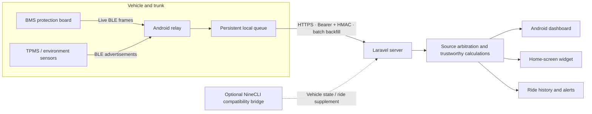

# WheelSense

[简体中文](README.md) | [English](README_EN.md)

WheelSense is an independently developed, open-source EV telemetry system. It can work with optional third-party compatibility bridges for Ninebot/Segway devices, but it is not affiliated with, authorized by, sponsored by, endorsed by, or officially connected with Ninebot, Segway, 九号, or any of their affiliates. Product and trademark names are used only to describe compatibility or data sources; all trademarks belong to their respective owners.

[](https://github.com/lovemygoddess/wheelsense/actions/workflows/ci.yml)
[](LICENSE)
[](#building-the-android-apps)
[](#quick-server-deployment)

**Turn fragmented data from the vehicle, BMS, trunk-mounted phone, and optional cloud sources into one trustworthy, continuous vehicle state that the owner controls.**

The project combines a Laravel server, an unattended Android BLE relay, a React Native/Expo dashboard, and a native Android home-screen widget. It covers the complete path from sensor acquisition and offline buffering to source arbitration, explainable calculations, and a consumer-facing interface.

It is not merely an API response rendered as charts. It addresses the difficult parts of real vehicle telemetry:

- **Which source should be trusted?** BMS readings, vehicle snapshots, and historical estimates may disagree about SOC, consumption, and range.
- **What happens when the relay or network fails?** Samples must not silently disappear, and stale values must not be presented as live data.
- **How can estimates reflect the actual vehicle?** Range and charging time should use measured current, remaining capacity, and energy intervals whenever possible.
- **Who controls the data?** Routes, location, account state, photos, and telemetry stay on infrastructure operated by the user.
- **How should failure be represented?** Live, stale, offline, degraded, and unavailable are distinct states. A value being present does not make it current or trustworthy.


*The overview image uses compatibility names only for identification. This project is independent and unofficial.*

> Self-hosted telemetry for electric two-wheelers, with an offline-first Android relay, explicit source freshness, measured-energy calculations, and privacy-preserving data ownership.

## Interface Preview

<p align="center">
  
  
  
</p>
<p align="center">
  
  
  
</p>

### Android Home-Screen Widget


> Screenshots contain synthetic, anonymized demo data. They do not contain real vehicles, accounts, servers, routes, locations, or sensor identifiers. The reproducible renderer is available at [`tools/render_demo_screenshots.py`](tools/render_demo_screenshots.py).

### Demo Mode and Theme Packs

- The More page exposes a Demo Mode that switches vehicle, relay, battery, ride, monitor, and widget surfaces to one centralized set of stable synthetic data. Turning it off restores the self-hosted data source.
- Demo Mode is independent from visual themes. It works with Default-Tech and Light/Dark variants as well as Anime Theme 01; dashboard motion uses a deterministic lightweight simulator suitable for screenshots and live demonstrations.
- Theme Packs own colors, layout tokens, and optional decoration only. Anime Theme 01's Chii artwork is separately identified third-party material; read [`apps/dashboard/assets/themes/anime-01/NOTICE.md`](apps/dashboard/assets/themes/anime-01/NOTICE.md) before using it.
- The mobile server URL is never hard-coded in the public source. Enter it in the app settings or use `EXPO_PUBLIC_SERVER_URL` from [`apps/dashboard/.env.example`](apps/dashboard/.env.example) for development builds.

## Why This Project Exists

Many vehicle apps display calculations already made by a vendor cloud, while BMS utilities often remain low-level Bluetooth diagnostic tools. The space between them is poorly served: a system that stays close to the physical battery, converts raw readings into useful daily information, degrades honestly when devices go offline, preserves history, and does not require giving private data to another hosted platform.

This repository provides a complete, reusable reference for:

- unattended Android BLE acquisition;
- persistent local queues, batched upload, retry, deduplication, and backfill under weak or intermittent networks;
- explicit priority, freshness, and consistency contracts across multiple data sources;
- consumption learning from measured `V × I × Δt` intervals;
- one SOC, range, charge-time, and connection-state definition across the app, widget, and API;
- security boundaries for sensitive telemetry, remote operations, credentials, and APK updates.

## Trustworthy Calculations: A Number Is Not Enough

The most substantial part of this project is not the UI. It is the arbitration layer that turns conflicting data with different update rates into one explainable result. The system does not blindly copy vendor-cloud SOC, consumption, or range, and it does not keep presenting expired telemetry as current.

### Real-Time Charging Power

- With a fresh protection-board frame, charging power is calculated from voltage and charging current in that same frame: `P = V × I`, while retaining charge/discharge direction.
- NineCLI consumption is not used as the primary energy source.
- Fresh BMS current above the charging threshold is the primary charging detector, avoiding a false charging state caused only by an old flag or vehicle event.
- Incomplete, stale, or directionally inconsistent frames are degraded or marked unavailable instead of being disguised by precise-looking decimals.

### Remaining Charge Time

- The preferred model uses BMS total capacity, remaining capacity, and live charging current to determine the missing Ah.
- A SOC-dependent correction accounts for constant-voltage taper near full charge, where current falls and the final portion takes disproportionately longer.
- If the BMS capacity counter conflicts with terminal voltage, the system does not claim “full” or “1 minute remaining”; it falls back to a lower-confidence SOC/voltage model.
- If live capacity is unavailable, calibrated pack energy, the unified SOC, and measured charging power can be used. Historical complete-charge curves are a secondary fallback.
- Insufficient samples, a degenerate model, or an unreasonable result produces “unavailable” rather than a misleading exact duration. Optional NineCLI charge events provide historical context only when the relay is unavailable.

### Trustworthy Remaining Range

- SOC prefers the BMS non-rounded ratio of remaining Ah to total Ah, reducing visible jumps around integer percentage boundaries. A voltage curve is the fallback; vendor SOC is reference-only.
- Ride energy is integrated over consecutive BMS `V × I` frames. Gaps longer than 180 seconds are not fabricated, and a ride with less than 85% energy coverage is excluded from learning.
- Only physically plausible samples are accepted. With enough samples, median absolute deviation removes outliers and recent real-world rides receive greater weight.
- Range is calculated consistently as `trusted SOC × usable pack energy ÷ trusted measured Wh/km`.
- Vendor range calibrated for the original battery is deliberately not used as a fallback, avoiding severely inflated results on replaced or modified battery packs.
- The home screen, widget, and API reuse the same primary telemetry result instead of calculating different ranges independently.

### Honest Offline Degradation

Fresh BMS data is preferred when both the relay and protection board are available. When the board is temporarily unavailable, the result may degrade to resting voltage, the latest trusted calibration, or an optional vehicle snapshot, depending on context. Each result carries its source, capture time, freshness, quality, and degradation reason. “Relay online,” “board connected,” and “safe for real-time decisions” are therefore not treated as the same state.

## Design Principles

| Principle | Implementation |
| --- | --- |
| Measured data first | Prefer BMS voltage, current, remaining capacity, and cell data; do not use NineCLI consumption as the core energy input |
| Freshness before presence | Every snapshot has a capture time; live, stale, offline, and unavailable are different states |
| Explainable degradation | Preserve useful fallbacks while exposing their source, age, and reduced confidence |
| Offline first | Persist samples and events locally before batched upload, so short outages do not immediately create history gaps |
| One definition | Home, battery, widget, and API surfaces share one SOC, range, charging, and connection-state contract |
| Least privilege | Relay remote control is disabled by default; dangerous commands require a separate server-side flag |
| User-owned data | Users operate the server; maintainers do not receive their telemetry, routes, photos, or account data |

## Architecture



### Source and Fallback Policy

| Data | Preferred source | Behavior when unavailable |
| --- | --- | --- |
| Voltage, current, SOC, temperature, cells | Live BMS through the relay | Mark stale/offline; use a vehicle snapshot or calibrated estimate only where appropriate |
| Ride energy | Integrated BMS energy intervals | Do not learn from incomplete windows |
| Range | Unified SOC/remaining energy and trusted measured consumption | Degrade explicitly; never calculate a separate value per screen |
| Remaining charge time | BMS remaining capacity, live current, and taper model | Use optional history only as fallback; do not fabricate exact minutes |
| Rides and maximum speed | Optional vehicle compatibility bridge | Core BMS functions remain available without it |
| Tire pressure and temperature | TPMS BLE advertisements | Hide or mark unavailable outside the freshness window |

## Main Components

### Daily Dashboard

- Unified visual language across overview, battery, live dashboard, ride history, and settings;
- hierarchical presentation of SOC, trustworthy range, power, temperature, cell delta, tire pressure, and location;
- native Android widget with vehicle state, SOC, range, charging indicator, location, and fresh tire pressure;
- separate relay liveness, protection-board connection, and telemetry-frame freshness;
- detailed cells, battery diagnostics, and developer information collapsed by default.

### Unattended Android Relay

- Android 8+ foreground service for persistent BMS connection and BLE sensor scanning;
- persistent local queue, batched upload, retry, and historical backfill;
- relay-phone battery, charging, and runtime status reporting;
- boot recovery, remote configuration, and same-signature APK updates;
- optional operations such as photos, screenshots, reboot, and system commands, rejected by the server by default.

### Server and Data Layer

- self-hosted Laravel API with SQLite storage and Docker Compose deployment;
- relay Bearer token plus request-body HMAC, with paired credential rotation;
- unified snapshot contract shared by the app, widget, and history views;
- coverage-gated measured-consumption learning that rejects stale or incomplete samples;
- ride history, monthly summaries, charge sessions, TPMS, environmental samples, and alert history;
- optional Amap, EZVIZ, notification webhook, and NineCLI compatibility integrations.

## Repository Layout

| Path | Purpose |
| --- | --- |
| `server/` | Laravel API, SQLite models, source arbitration, calculations, history jobs, alerts, and update distribution |
| `apps/dashboard/` | React Native/Expo Android dashboard, native modules, and home-screen widget |
| `apps/relay/` | Kotlin Android BLE relay, protocol parsing, offline queue, and unattended service |
| `docs/` | Deployment and configuration documentation |
| `.github/workflows/` | CI checks for the server, dashboard, and relay |

## Intended Audience and Project Boundaries

WheelSense is not a universal app for every vehicle model. It is primarily intended for:

- owners using replacement, third-party, or modified battery packs for which vendor SOC, consumption, or range estimates are no longer reliable;
- technical users willing to deploy Docker on a Linux host, NAS, or Raspberry Pi;
- developers and enthusiasts interested in BMS, BLE, TPMS, multi-source telemetry, and data trustworthiness;
- users who prioritize data ownership and want routes, location, account state, and sensor data to remain on their own server.

Deployers must configure the server, verify protocol compatibility, manage credentials, and apply appropriate security hardening. If you need a hosted, low-configuration, plug-and-play app for arbitrary models, this project is probably not the right fit.

The goal is not maximum model or user coverage. It is to solve a narrower problem well: producing continuous, trustworthy, explainable vehicle state under conflicting sources, intermittent networks, and non-original hardware. The result is both a system for owners who genuinely need it and a complete reference implementation for developers building BMS, BLE, offline acquisition, or vehicle-data fusion systems.

It is not a hardware safety controller. Every BMS protocol, vehicle interface, and TPMS encoding must be verified against the actual device.

## Quick Server Deployment

Docker and Docker Compose are required.

```bash
cp server/.env.example server/.env
mkdir -p data/database data/storage
docker compose build
docker compose run --rm server php artisan key:generate --show
docker compose run --rm server php artisan evtelemetry:relay-credentials
```

Put the generated `base64:...` value in `APP_KEY`, and place the generated `BMS_RELAY_TOKEN` and `BMS_RELAY_HMAC_SECRET` in `server/.env`. Then start the service:

```bash
docker compose up -d
docker compose exec server php artisan evtelemetry:set-dashboard-password
```

The default endpoint is `http://<host-ip>:8000`. For public access, place an HTTPS reverse proxy in front of it. Do not expose a PHP development server directly to the internet.

## Relay Configuration

1. Build and install the `apps/relay` APK.
2. Expand the relay's advanced settings.
3. Enter the server URL, generated Token/HMAC, vehicle identifier, and sensor addresses.
4. Save the configuration and start the service.

Relay self-update downloads `server/storage/app/bms-relay-latest.apk`. With Docker, place the new APK at `data/storage/app/bms-relay-latest.apk`. Android permits an in-place update only when the application ID and signing certificate match and the version code is higher.

## Building the Android Apps

JDK 17 and Android SDK 35 are required. The dashboard also requires Node.js 20+. The public native configuration currently produces `arm64-v8a` APKs only.

```bash
cd apps/relay
./gradlew assembleDebug

cd ../dashboard
npm ci --legacy-peer-deps
cd android
./gradlew assembleDebug
```

Create and protect your own release keystore before distributing builds. Do not publish APKs signed with the debug key.

## Optional Integrations and Boundaries

- NineCLI is an optional, independent compatibility bridge. It is not included in this repository and does not represent an official API. Core BMS battery telemetry remains usable without it; vehicle-cloud state and cloud ride features degrade.
- Amap, EZVIZ, and notification webhooks are optional and do not affect the core BMS path.
- TPMS addresses and calibration parameters belong in `server/.env`; defaults are starting points, not substitutes for physical validation.
- WheelSense uses the independent `io.github.lovemygoddess.wheelsense` application ID and intentionally cannot replace other builds.
- The currently validated target is ARM64 Android with the documented protocol combination. Other hardware requires testing.

See [`docs/configuration.md`](docs/configuration.md) for configuration details. Read [`SECURITY.md`](SECURITY.md) and [`PRIVACY.md`](PRIVACY.md) before deployment.

## Security and Privacy

Running this software does not send project data to the maintainers. In a self-hosted deployment, the deployer is the data controller for vehicle state, routes, photos, and account information.

- Use HTTPS for public access and restrict administrative endpoints.
- Generate unique relay Token/HMAC and widget credentials for every deployment.
- Never commit `.env`, databases, signing keys, photos, tracks, or real device identifiers.
- Relay remote control is disabled by default; dangerous commands require an additional explicit server-side switch.
- Report vulnerabilities privately through GitHub Security Advisories. Do not place credentials or real locations in public issues.

This project has not undergone an independent third-party security audit. It must not be used as a substitute for BMS protections, fuses, chargers, or any other safety-critical hardware control.

## Development and Verification

```bash
# Server
cd server
composer install
cp .env.example .env
touch database/database.sqlite
php artisan key:generate
php artisan migrate
php artisan test

# Dashboard
cd apps/dashboard
npm ci --legacy-peer-deps
npx tsc --noEmit

# Relay
cd apps/relay
./gradlew test assembleDebug
```

CI validates the server telemetry contract, TypeScript types, dashboard Android build, and relay tests/build.

## Contributing

Issues, documentation improvements, and pull requests are welcome, especially for:

- verifiable BMS or TPMS protocol adapters;
- tests for telemetry freshness, units, and degradation behavior;
- Android background-runtime and power-consumption results from different devices;
- self-hosting, privacy, and security improvements;
- generic data-source adapters that do not depend on private services.

Changes to telemetry algorithms or protocol parsers should include packet captures, a trusted reference value, or a reproducible test. Do not infer behavior only from field names. Read [`CONTRIBUTING.md`](CONTRIBUTING.md) before submitting changes.

## Project Status

This is an early community project extracted from a real, continuously maintained self-hosted deployment. Interfaces, protocol support, and deployment methods may continue to evolve. Remove serial numbers, MAC addresses, tokens, routes, and addresses before sharing diagnostic data.

## License and Disclaimer

Project code is released under the [MIT License](LICENSE). Third-party dependencies and assets retain their respective licenses; see [`THIRD_PARTY_NOTICES.md`](THIRD_PARTY_NOTICES.md).

This project is independent and unofficial. It is not affiliated with, endorsed by, sponsored by, or officially connected with Ninebot, Segway, 九号, or their affiliates. Trademark names are used only to describe compatibility. Users must access only accounts, vehicles, sensors, cameras, and data that they own or are explicitly authorized to access.

SOC, range, temperature, charge-time estimates, and alerts are informational only. They do not replace the BMS, fuse, charger, or any other hardware safety protection.
